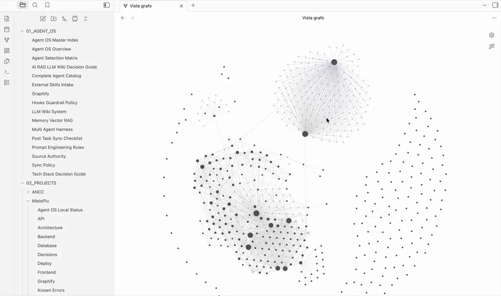

# IAF Agent Operating System — a control plane for AI-assisted development

> An orchestration layer that sits above Claude Code, Cursor, Codex and Antigravity, so that
> AI-assisted development is governable: every task gets an owner, a reviewer, a policy and a set
> of gates it has to pass before it can claim to be finished.

**Role** — designed and built independently. Personal, experimental project.
**Shape** — agents and subagents, skills, rules, hooks, multi-model routing, preflight checks,
security policy and a centralised knowledge base.

---

## The problem

AI coding tools are extremely capable and structurally unaccountable. Each one has its own
configuration format, its own idea of what an "agent" is, and no memory of the rules the previous
one agreed to. Give the same repository to four of them and you get four different conventions,
four different definitions of done, and no way to tell afterwards which decision was deliberate.

The failure mode is unverifiable work: changes that look finished, claim tests passed, and
cannot be traced back to a decision.

## What I built

A control plane that makes those four tools behave like one team with one rulebook.

A development task enters, gets classified, and is routed to an owner agent and a reviewer. The
skills, rules and policies relevant to that task are activated. The work is routed to the model
suited to it. When it finishes, it has to pass deterministic gates — not a model's opinion that
things went well.

## How a task moves through it

## Key capabilities

- **Task classification and routing** — an agent selection matrix maps a task's domain to the
  right owner and reviewer, so a database change is not handled as a generic edit.
- **Agents with a contract** — every agent declares its trigger, inputs, linked skills, stop
  conditions and the report it must produce.
- **Skills as executable workflows** — repeatable procedures with a verification checklist, not
  prose.
- **Cross-IDE parity** — the same agent roster expressed natively for each runtime: Markdown with
  frontmatter for Claude Code and Cursor, TOML for Codex, plus the corresponding rules, commands
  and hooks.
- **Deterministic gates** — shell checks that return OK / WARN / BLOCKING, so "done" is a
  computed result.
- **Preflight discipline** — before touching a repository, the environment, branch, remote and
  applicable policy have to be verified and declared.
- **A finish gate** — a task cannot close without tests, secret scan, integrity check and a
  report.
- **Knowledge base as an LLM Wiki** — decisions, architecture, API, database, deployment and known
  errors, navigable as a graph, with a branch per supported project.

## Engineering decisions

**Rules that matter have to be able to fail.** Anything important is a skill, an agent contract or
a shell check. A policy that cannot return a non-zero exit code does not change behaviour.

**Three levels of severity, not two.** Checks return CRITICAL, WARN or OPTIONAL. Two levels
force every rule to be either blocking or ignorable, and in practice that means everything
becomes ignorable.

**Native formats over a lowest common denominator.** Rather than inventing one config format and
asking every tool to adapt, each runtime gets its own native artefacts, generated to stay in
parity. Parity is then itself something a check verifies.

**One owner writes, everyone else reviews.** Concurrent agents editing the same code produce
conflicts nobody owns. Exactly one agent has write authority per phase; the rest review.

**Reference integrity is checked mechanically.** A document that cites a skill or script which
does not exist is a silent failure, because the model will happily proceed. An integrity checker
walks every reference across the whole system and fails on the phantom ones.

## Verification

The system checks itself. A representative run of the integrity checker over the master:

| Check | Result |
|---|---|
| Agent OS integrity | `CRITICAL=0 WARN=0 OPTIONAL=0` |
| Agent contracts | `WARN=0 BLOCKING=0` |
| Skill contracts | `WARN=0 BLOCKING=0` |
| Documentation operability | `WARN=0 BLOCKING=0` |
| Cross-IDE agent parity | `agents=114 BLOCKING=0` |
| Cross-IDE skill parity | `BLOCKING=0` |
| Security source coverage | `828 mapped, 0 unmapped` |

These are the system's own gates run against itself, which is the honest scope of the claim:
they show the control plane is internally consistent, not that it makes any particular codebase
correct.

## Why it exists

Every project in this profile is built with AI assistance. This layer records which agent owned
which phase, which policy applied, which gates passed, and what the report said.

## Source code

The source code is maintained in a private repository. The system encodes operational policies,
security rules and project-specific knowledge that are not intended for publication. This
repository documents the architecture and the design decisions.

## Links

- **Interactive case study** — [francescoiaforte.vercel.app/en/projects/iaf-agent-os](https://francescoiaforte.vercel.app/en/projects/iaf-agent-os)
- **Profile** — [github.com/francescoveryra-dot](https://github.com/francescoveryra-dot)
- **Full portfolio** — [francescoiaforte.vercel.app](https://francescoiaforte.vercel.app)
